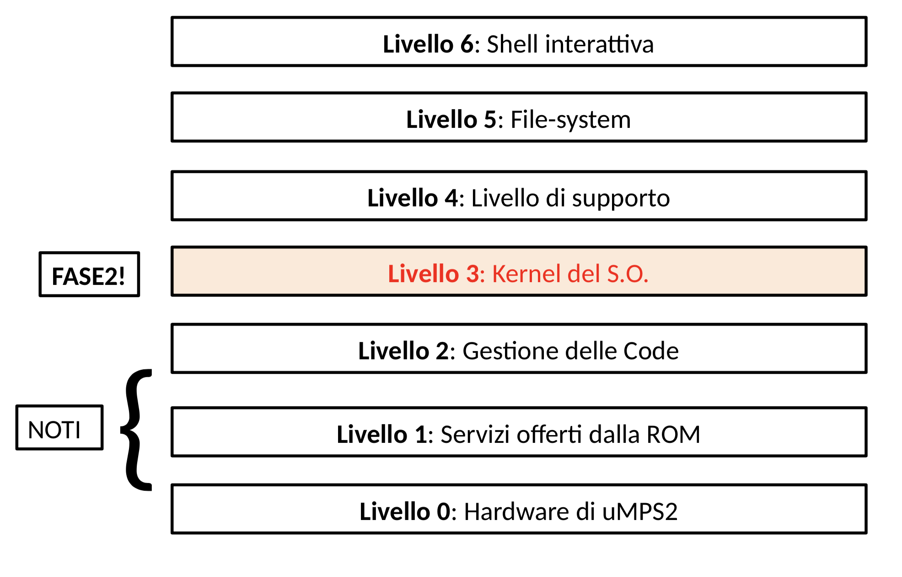

# RIKAYA_OS
Fase 2 del progetto del corso Sistemi Operativi 18/19 UniBO

# Progetto


Componenti da implementare in questa fase:
*
## Test


## Compilare per μMPS2
È necessario avere prima installato [μMPS2](https://github.com/tjonjic/umps).

Per compilare basterà lanciare il comando make dentro la cartella PHASE1.5_SO1819/src
```
$
$ make
```
Verrano creati due file, kernel.core.umps e kernel.stab.umps, che sono i file da usare per la configurazione della macchina emulata in μMPS2


# License
Progetto sotto GPLv3 License - vedere LICENSE.md per i dettagli
